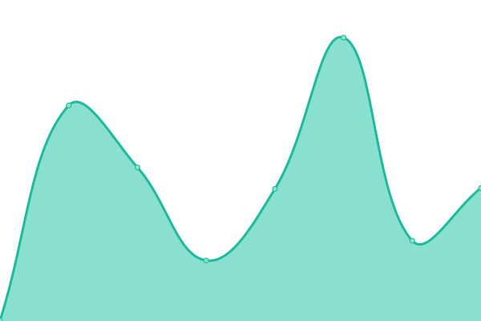

# [📈 Live Status](https://status.getstreamline.net): <!--live status--> **🟩 All systems operational**

This repository contains the open-source uptime monitor and status page for [Streamline](https://status.getstreamline.net), powered by [Upptime](https://github.com/upptime/upptime).

With [Upptime](https://upptime.js.org), you can get your own unlimited and free uptime monitor and status page, powered entirely by a GitHub repository. We use [Issues](https://github.com/getstreamline/upptime/issues) as incident reports, [Actions](https://github.com/getstreamline/upptime/actions) as uptime monitors, and [Pages](https://status.getstreamline.net) for the status page.

<!--start: status pages-->
<!-- This summary is generated by Upptime (https://github.com/upptime/upptime) -->
<!-- Do not edit this manually, your changes will be overwritten -->
<!-- prettier-ignore -->
| URL | Status | History | Response Time | Uptime |
| --- | ------ | ------- | ------------- | ------ |
|  [Streamline Landing](https://www.getstreamline.com) | 🟩 Up | [streamline-landing.yml](https://github.com/getstreamline/upptime/commits/HEAD/history/streamline-landing.yml) | 

 186ms
     
 | 

<a href="https://status.getstreamline.net/history/streamline-landing">97.10%</a>
    

|  [Special Districts Backend](https://production.getstreamline.net) | 🟩 Up | [special-districts-backend.yml](https://github.com/getstreamline/upptime/commits/HEAD/history/special-districts-backend.yml) | 

 500ms
     
 | 

<a href="https://status.getstreamline.net/history/special-districts-backend">100.00%</a>
    

|  [System Catalog](https://www.systemcatalog.net) | 🟩 Up | [system-catalog.yml](https://github.com/getstreamline/upptime/commits/HEAD/history/system-catalog.yml) | 

 291ms
     
 | 

<a href="https://status.getstreamline.net/history/system-catalog">100.00%</a>
    

|  [Check My District](https://www.checkmydistrict.org) | 🟩 Up | [check-my-district.yml](https://github.com/getstreamline/upptime/commits/HEAD/history/check-my-district.yml) | 

 296ms
     
 | 

<a href="https://status.getstreamline.net/history/check-my-district">97.10%</a>
    

<!--end: status pages-->

[**Visit our status website →**](https://status.getstreamline.net)

## 📄 License

- Powered by: [Upptime](https://github.com/upptime/upptime)
- Code: [MIT](./LICENSE) © [Anand Chowdhary](https://anandchowdhary.com), supported by [Pabio](https://pabio.com)
- Data in the `./history` directory: [Open Database License](https://opendatacommons.org/licenses/odbl/1-0/)
